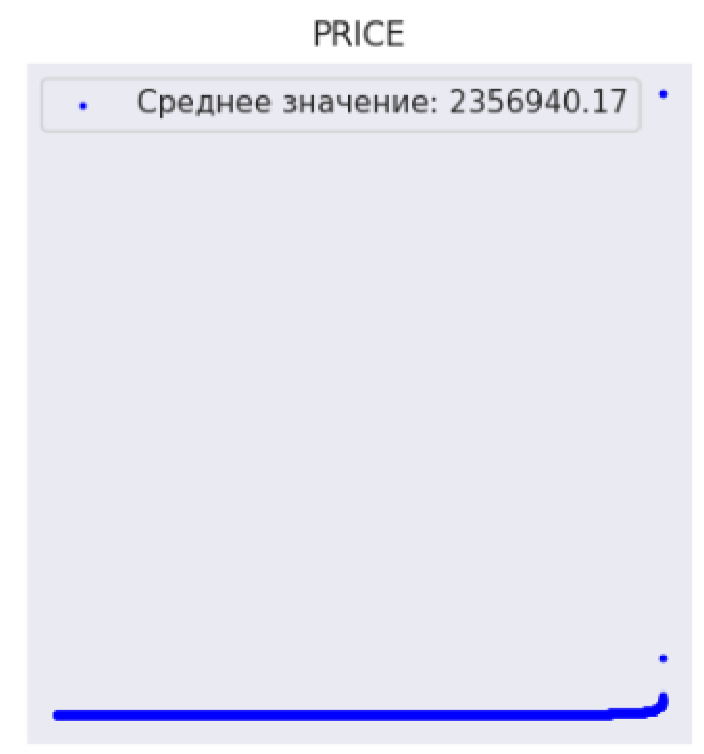
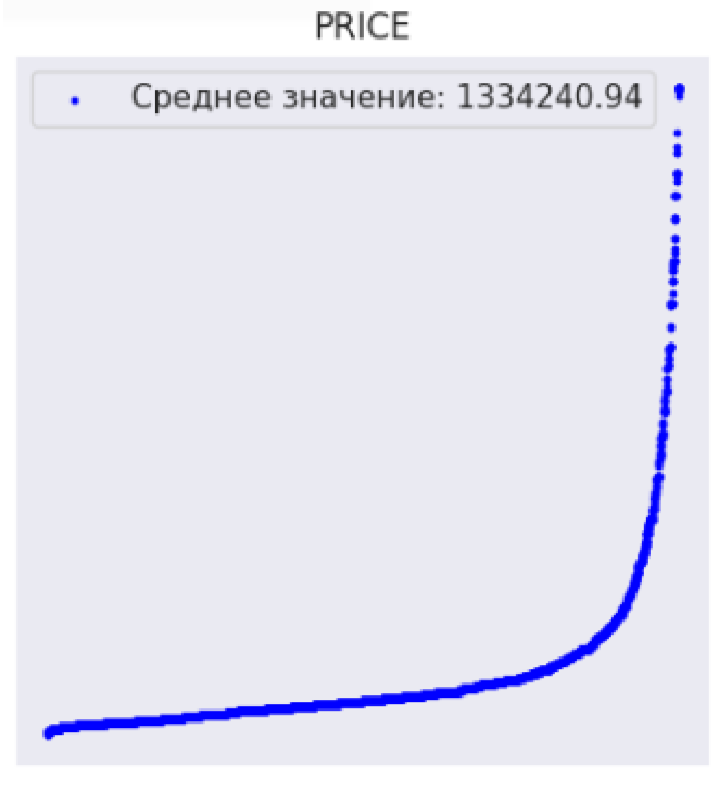
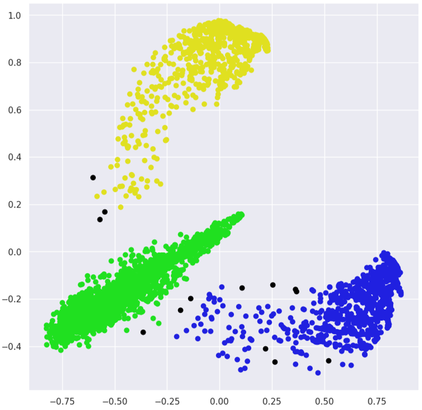
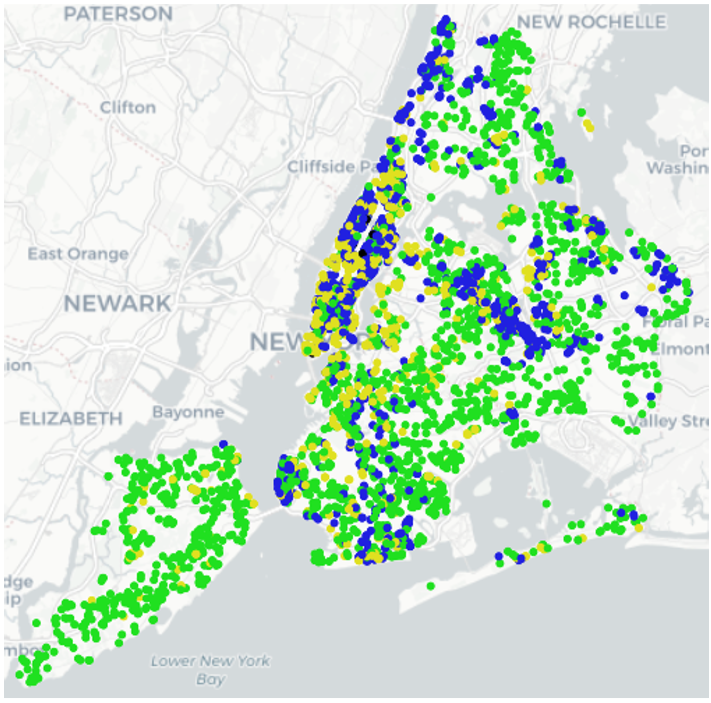
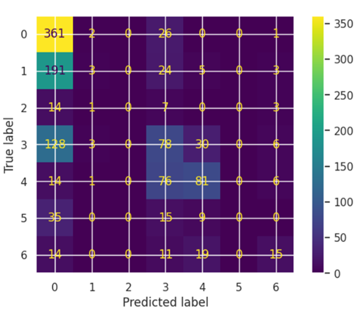
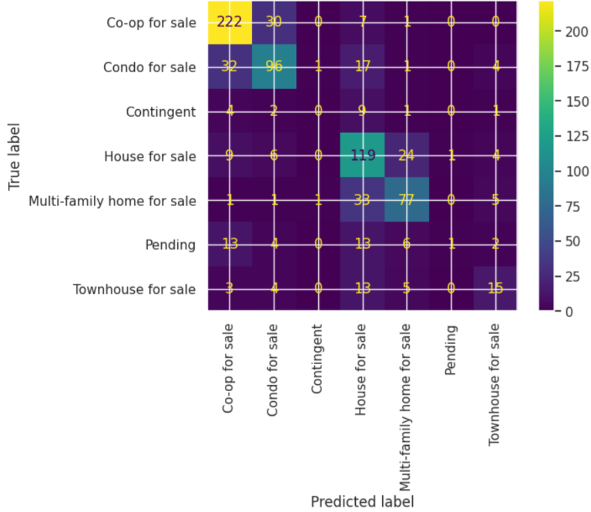
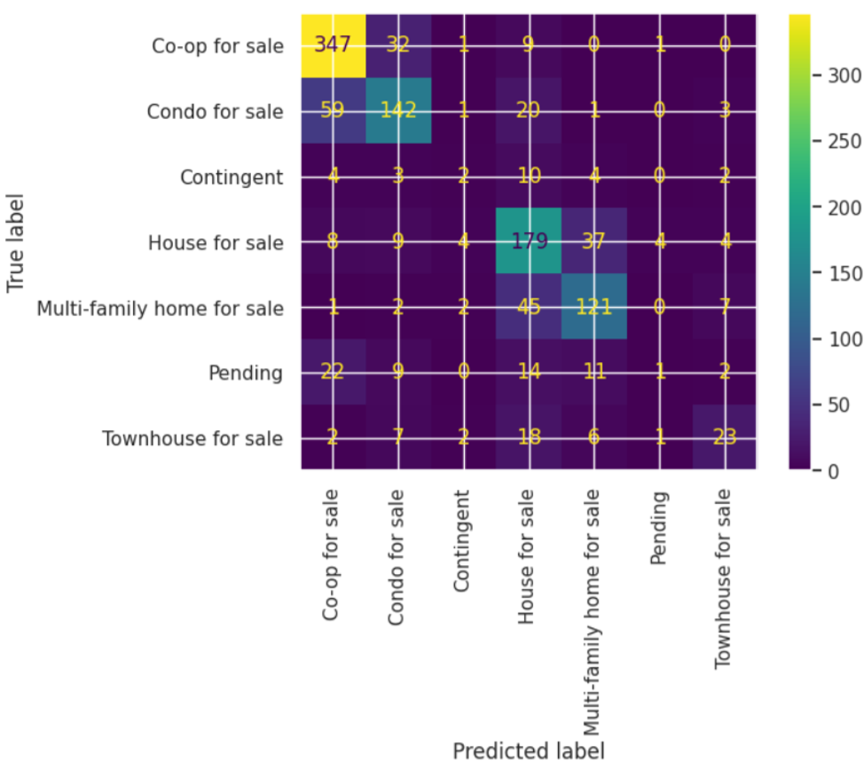

# Исследование рынка недвижимости в Нью-Йорке
Целью данной работы является исследование набора данных “New York Housing Market” методами машинного обучения.
## Анализ данных

Удалены записи с ценой больше 15.000.000$ (372 записи). 
Цены до удаления                                         | Цены после
:-------------------------------------------------------:|:-------------------------:
 | 

Количество уникальных брокеров, после приведения названий к нижнему регистру, с 944 сократится до 922.

## Результаты
### Регрессия
Для прогнозирования цены были выбраны признаки: количество спален, ванных комнат, общую площадь, координаты и тип. 

Размер тренировочного набора 30%. Использвался *метод полиномиальной регресии*.

Результаты: 
Метрика                    | Результат
:--------------------------|:------------------
R2 score                   | 0.63545627
Cреднекавдратичная ошибка  | 1208005072731.7632

### Кластеризация
Для кластеризации были выбраны признаки: количество спален, ванных комнат, общую площадь, координаты, цена и тип. Была уменьшена размерностьс помощью *PCA*.
|  | P1        | P2        |
|:-|----------:|----------:|
|0 |  0.039128 |  0.936478 |
|1 | -0.534006 | -0.301995 |
|2 |  0.135099 |  0.852512 |
|3 | -0.624146 | -0.400197 | 
|4 | -0.049632 |  0.896804 |

Параметры *eps* = 0.063 и *min_samples* = 4 были подобраны таким образом, чтобы получить 3 кластера количество кластеров.

**Результат**

     
    

        <em>Распределение записей по кластерам на единичном квадрате</em>
    

 

     
    

        <em>Распределение записей по кластерам на карте Нью-Йорка</em>
    

Модель реалистично отображает социальную ситуацию и рынки недвижимости соседств в Нью-Йорке. 

### Классификация
Для предсказания типа недвижимости выбраны основные признаки: количество спален, ванных комнат, общую площадь.

**Метод Наивного Байеса с алгоритмом Гаусса**

     

Размер тестовой выборки 15%.

| Название                   | precision | recall | f1-score | support |
|:---------------------------|:---------:|:------:|:--------:|:-------:|
| Co-op for sale             | 0.48      | 0.93   | 0.63     | 390     |
| Condo for sale             | 0.30      | 0.01   | 0.03     | 226     |
| Contingent                 | 0.00      | 0.00   | 0.00     | 25      |
| House for sale             | 0.33      | 0.32   | 0.32     | 245     |
| Multi-family home for sale | 0.56      | 0.46   | 0.50     | 178     |
| Pending                    | 0.00      | 0.00   | 0.00     | 59      |
| Townhouse for sale         | 0.44      | 0.25   | 0.32     | 59      |
| accuracy                   |           |        | 0.46     | 1182    |
| macro avg                  | 0.30      | 0.28   | 0.26     | 1182    |
| weighted avg               | 0.39      | 0.46   | 0.37     | 118     | 

\
**Дерево решений**
 

Размер тестовой выборки 20%.

| Название                   | precision | recall | f1-score | support |
|:---------------------------|:---------:|:------:|:--------:|:-------:|
| Co-op for sale             | 0.78      | 0.85   | 0.82     | 260     |
| Condo for sale             | 0.67      | 0.64   | 0.65     | 151     |
| Contingent                 | 0.00      | 0.00   | 0.00     | 17      |
| House for sale             | 0.56      | 0.73   | 0.64     | 163     |
| Multi-family home for sale | 0.67      | 0.65   | 0.66     | 118     |
| Pending                    | 0.50      | 0.03   | 0.05     | 39      |
| Townhouse for sale         | 0.44      | 0.25   | 0.32     | 59      |
| accuracy                   |           |        | 0.67     | 788     |
| macro avg                  | 0.52      | 0.47   | 0.46     | 788     |
| weighted avg               | 0.65      | 0.67   | 0.65     | 788     |

Точность предсказаний: 0.6725888324873096

**Случайный лес**
  

| Название                   | precision | recall | f1-score | support |
|:---------------------------|:---------:|:------:|:--------:|:-------:|
| Co-op for sale             | 0.78      | 0.89   | 0.83     | 390     |
| Condo for sale             | 0.70      | 0.63   | 0.66     | 226     |
| Contingent                 | 0.17      | 0.08   | 0.11     | 25      |
| House for sale             | 0.61      | 0.73   | 0.66     | 245     |
| Multi-family home for sale | 0.67      | 0.68   | 0.68     | 178     |
| Pending                    | 0.14      | 0.02   | 0.03     | 59      |
| Townhouse for sale         | 0.56      | 0.39   | 0.46     | 59      |
| accuracy                   |           |        | 0.69     | 1182    |
| macro avg                  | 0.52      | 0.49   | 0.49     | 1182    |
| weighted avg               | 0.66      | 0.69   | 0.67     | 1182    |
